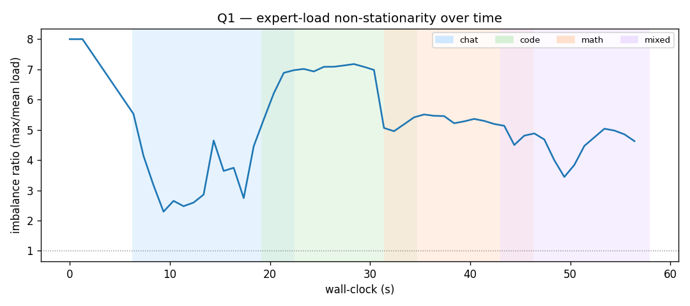
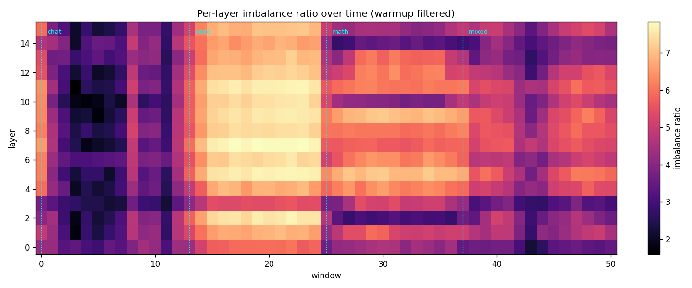
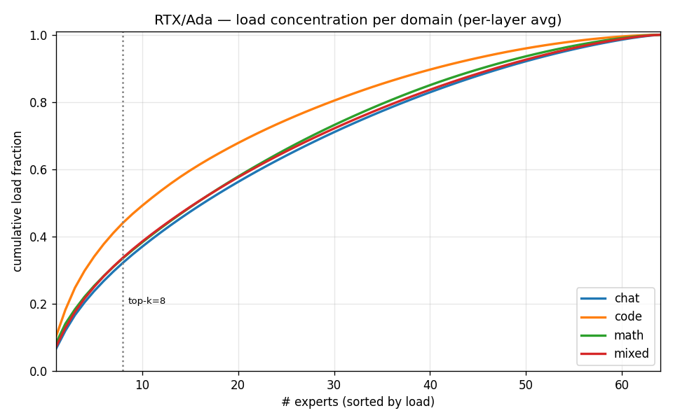
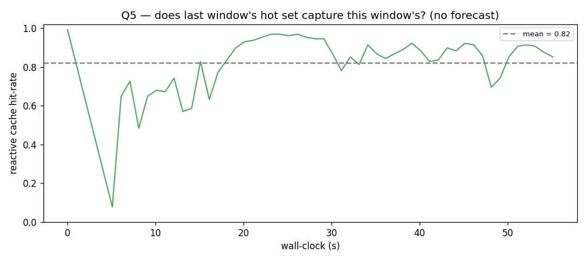
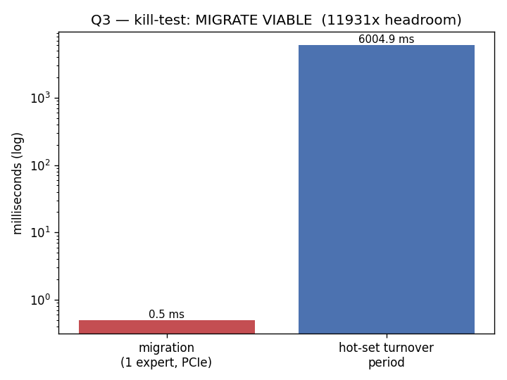
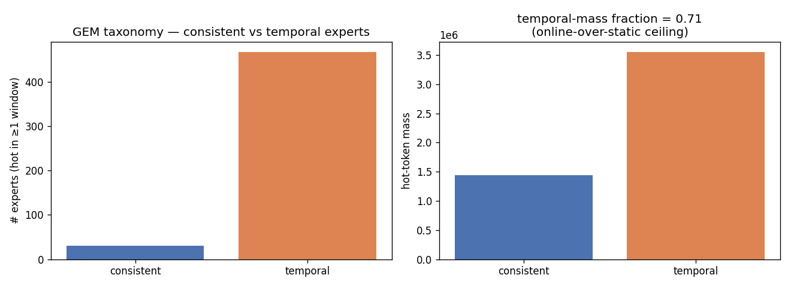

# B2 update — post draft (MoE expert imbalance on OLMoE)

Posting-ready draft + the exact order to share it in. Charts referenced live in
`code/b2/charts/` (all on **real-prompt** data). Read top-to-bottom; each numbered block is a
chart + the one or two lines to say next to it. Source: real capture
`code/b2/runs/capture-real/20260608T024014` (RTX 6000 Ada, 480 reqs).

---

## 0. Opening (set the frame)

> hey guys — wanted to share some MoE-inference benchmark results from this weekend.
>
> **Setup:** 1× RTX 6000 Ada (46 GB) on WatGPU, vLLM serving **OLMoE-1B-7B-0924-Instruct**,
> BF16 (16 layers, 64 experts, top-8).
>
> **Workload:** 480 requests, 120 each, played as a drifting sequence
> **chat → code → math → mixed** (max 128 tokens/req). All real prompts:
> chat = **ShareGPT**, code = **HumanEval**, math = **GSM8K**, mixed = the three interleaved.
> *(wanted LMSYS-Chat-1M for chat too but it's access-gated — ShareGPT covers it.)*
>
> Goal: reproduce the expert-imbalance result and see if there's a real opening for an
> **online serving** idea that holds a latency/cost SLO on heterogeneous GPUs.

**Baseline response times** (single RTX 6000 Ada, ~10 req/s, ≤32 concurrent, end-to-end):

| p50     | p75     | p90     | p95     | p99     |
| ------- | ------- | ------- | ------- | ------- |
| 3399 ms | 3504 ms | 3574 ms | 3595 ms | 3614 ms |

> Tight (p50≈p99) because ~every request hit the 128-token output cap, so each does ~the same
> decode work under steady batched load. **Caveat:** this is a *single-GPU baseline at one load
> point*, end-to-end (prefill + 128 batched decode steps) — not an SLO result, and not yet split
> into TTFT (prefill) vs per-token decode latency. It's the "before" picture the cache idea aims
> to improve on a heterogeneous fleet.

---

## 1. Headline — expert load is non-stationary
**Chart:** `q1_imbalance_over_time.png`

> The **imbalance ratio** = (busiest expert's load) / (average expert load) in a 1-s window,
> averaged over the 16 layers. 1.0 = perfectly balanced; higher = more lopsided.
> It swings **2.3 → 8.0** and **tracks the active domain**: chat ~3, **code ~7 (most skewed)**,
> math ~5.5, mixed ~5. So *which* experts are hot is not fixed — it moves with the workload.

## 2. The skew is network-wide
**Chart:** `insight_layer_imbalance.png`

> Per-layer imbalance over time. The **whole layer-stack flips** at each domain boundary
> (dark = balanced chat → bright = skewed code). It's not one rogue layer — all 16 show it,
> strongest in the middle layers.

## 3. How sharply load concentrates (per domain)
**Chart:** `insight_concentration_cdf.png`

> Cumulative load vs #experts, per domain (Gini in parens): **code 0.50 (top-8 = 44% of load)**
> > math 0.38 > mixed 0.37 > chat 0.35. Code routes ~3.5× more concentrated than uniform; chat
> is the flattest. Same ordering as the imbalance ratio — code is the standout.

## 4. Why caching could work — it's cacheable without forecasting
**Chart:** `q5_reactive_hit_rate.png`

> If you just keep **last window's** hot set resident, it already covers **83%** of *this*
> window's hot experts (91% if you remember the last 3 windows). Within a domain the hot set is
> stable (Jaccard 0.66–0.74); it only churns at domain boundaries. → a **reactive** cache (react
> to recent load, no prediction) is enough.

## 5. Why caching is feasible online — drift ≪ migration
**Chart:** `q3_migration_vs_turnover.png`

> One expert is ~12.6 MB → moving it across PCIe takes **~0.5 ms**, while the hot set takes
> **~6 s** to turn over — a **~12,000× margin**. So a controller can chase the hot set far
> faster than it moves. *(migration time is an analytic PCIe-Gen4 estimate for now; turnover is
> measured.)*

## 6. Is there room for online over static? Yes — most hot work is bursty
**Chart:** `q_taxonomy.png`

> Split experts into **consistent** (hot in ≥85% of windows — a static average catches these)
> vs **temporal** (bursty). **71% of hot-token mass is temporal** → a static placement can't
> capture most of the hot work, which is the *ceiling* on how much an online policy can win.
> ~30 experts are consistent (pin them on the fast tier); the 71% temporal mass is what a
> reactive cache chases.

---

## Why an online cache (the "so what") — the focus

The results line up into one specific argument: an **online, reactive expert cache** — keep the
currently-hot experts on the fast/expensive GPUs, the cold tail on the cheap/slow ones. Each
premise is one of the charts above:

1. **There's a hot set worth caching.** Load is concentrated (top-8 ≈ 44% in code) and lopsided
   (imbalance up to 8×) — putting just the hot experts on fast GPUs would relieve most of the
   straggler. *(charts 1–3)*
2. **A *static* cache can't capture it — this is the crux (chart 6).** Only ~30 experts are
   *consistently* hot; **71% of the hot-token mass is *temporal*** — bursty, hot only while its
   domain is active. A fixed "hot→fast" placement chosen from the average grabs the 29%
   consistent mass and **misses the 71% that moves.** That 71% is precisely the headroom an
   online policy unlocks, and it's the *majority* of the work → the cache **must be online**, not
   a one-time placement.
3. **Online can be *reactive*, not predictive (chart 4).** No need to forecast the next domain —
   last window's hot set already covers **83%** of the next window's. Just react to measured
   recent load: cheap, workload-agnostic, no model.
4. **There's time to act (chart 5).** Hot set drifts on a ~6 s timescale; an expert migrates in
   ~ms — a **~12,000× margin**. The controller can chase the hot set far faster than it moves, so
   "react" actually keeps up.

**Together:** pin the ~30 consistent experts on the fast tier, and *chase* the 71% temporal mass
online by caching the recently-hot ones. That should **hold a p99 SLO at lower $/token than
putting everything on fast GPUs** — biggest win in the most-skewed domains (code/math), which is
also where the SLO is hardest. The two things we explicitly *don't* need: a static oracle, or a
workload predictor.

## Caveats (being upfront)

> - **The fast-vs-slow tier gap isn't measured yet.** Our heterogeneous node (RTX 6000 Ada +
>   A6000) was down for a reboot, so I could only probe modern cards (H200 vs Ada ≈ same speed
>   on this small expert). The actual latency/$ SLO numbers need the A6000 → next run.
> - **Prefill vs decode not split yet.** vLLM's continuous batching fuses prefill+decode in
>   every forward, so I'm logging combined load. Splitting them is next — decode is the
>   latency-critical, memory-bound phase, so its hot-set behavior is what the SLO rides on.
> - Prompts are real (ShareGPT/HumanEval/GSM8K) but it's a curated drift sequence, not a
>   production trace.

## What's next (benchmarks)

> 1. **Measure the real tier gap** on the Ada+A6000 node → the actual p99-SLO / $/token for
>    static vs reactive placement (the headline cost result).
> 2. **Prefill/decode split** via per-token phase tagging in the logging hook.
> 3. **Routing-granularity sweep** — does the skew survive finer-grained MoE?
>    Qwen3-30B-A3B (128 experts, the stress test) and Mixtral-8×7B (8 experts, sharpest skew).
> 4. **More realistic load** — higher request rates, longer/decode-heavy generations, real
>    arrival patterns (+ ungate LMSYS for richer chat).
> 5. **FP8 on Ada** as a tier-gap amplifier (FP8-Ada vs BF16-Ampere widens fast:slow).

---

### Posting checklist
- [ ] Attach charts **1–6 in order** (q1 → layer heatmap → concentration → q5 → q3 → taxonomy).
- [ ] Do **not** attach q2/q4 (placement sim) — they need the A6000 to be meaningful.
- [ ] (optional) regenerate q1 without the ~6 s warmup plateau for a cleaner headline.
