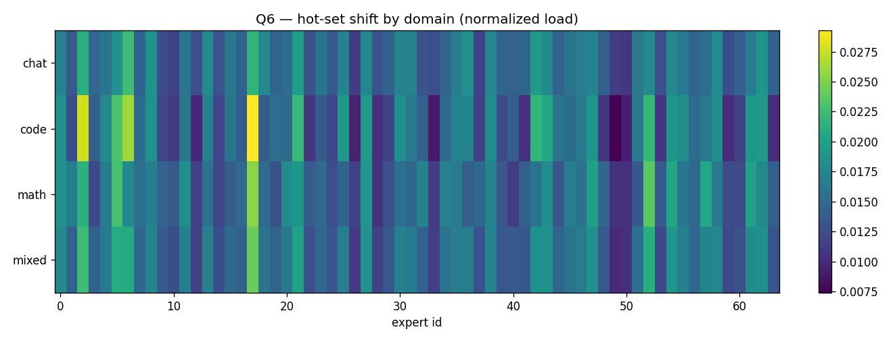

# First Benchmark Results for B2 
---

## Conditions

|                   |                                                                                 |
| ----------------- | ------------------------------------------------------------------------------- |
| **Model**         | `allenai/OLMoE-1B-7B-0924-Instruct`, BF16 (16 layers, 64 experts, top-8)        |
| **Serving**       | vLLM fork `u3anand/vllm @ b2-expert-telemetry` (`84969d1a4`), `--enforce-eager` |
| **GPU (capture)** | 1× **RTX 6000 Ada** (46 GB), watgpu108, via the **ALL** partition               |
| **Tier bench**    | **H200 NVL** (watgpu508) vs **RTX 6000 Ada** (watgpu608), single-GPU each       |
| **Env**           | `uv` venv (no conda on the cluster), torch 2.11.0+cu130                         |
| **Trace**         | mixed drifting, 600 requests, 150 each of chat→code→math→mixed, max 128 tok     |
| **Capture**       | 64,991 expert rows, 67 windows (65 after warmup filter), 1 s windows            |
|                   |                                                                                 |

---

## Things I had to do

1. **Turn off flashinfer.** vLLM's sampler calls `flashinfer.top_k_top_p_sampling`, which
   **JIT-compiles a CUDA kernel at startup and needs `nvcc`** — absent in the `uv` env (torch
   ships the CUDA *runtime*, not the toolkit). The server crashed at engine init with
   `Could not find nvcc`. Fix: `VLLM_USE_FLASHINFER_SAMPLER=0` + `VLLM_ATTENTION_BACKEND=FLASH_ATTN`
   (prebuilt flash-attn, no JIT). We don't need flashinfer — greedy decode, Triton MoE.
2. **`uv`, not conda.** The cluster has no conda; rewrote `setup.sh` to build a `uv` venv.
3. **ALL partition + cross-node tier bench.** With 308 down, GPUs are one-per-node (different
   model each), so the same-node dual-tier bench can't run — added `tier_bench --single`/
   `--combine` to measure each GPU separately and merge.
4. **Filter vLLM warmup.** The startup profiling run emits a few windows (imbalance pinned at
   8.0) *before* the replay; filtered them out for clean per-segment stats.
5. **Phase tagging didn't separate.** The hook records `phase{prefill|decode}`, but it came
   back **uniformly "mixed"**: vLLM v1 **continuous batching fuses prefill + decode in every
   forward**, so the pure-phase heuristic never sees a single-phase batch. Real phase split
   would need **per-token phase tagging** (a future hook refinement), not a per-forward tag.

---

## Important graphs & conclusions

### 1. Expert load is non-stationary and domain-driven (the headline)

Imbalance ratio (max/mean expert load) swings **2.1 → 8.0** and tracks the active domain:
chat ~3.1, **code ~6.7 (most skewed)**, math ~5.5, mixed ~4.7.

### 2. The drift is consistent across all 16 layers

Per-layer imbalance over time: the **whole column flips** at each domain boundary (chat dark/
low → code bright/high → math high → mixed medium). Skew is network-wide (per-layer mean
4.0–5.3, strongest in the middle layers), not confined to one layer → a tier-cache helps
everywhere. Domain hot-set Jaccard confirms distinctness: **chat↔math 0.23**, chat↔code 0.33.

### 3. Hot set shifts by domain (which experts fire)

Code concentrates hard on experts 2/6/17; chat is diffuse; math lights up 17/52. Different
domains → different hot experts → there is a hot set worth caching, and it moves.

### 4. A reactive cache works without forecasting (Q5)

Keeping last window's hot set resident captures **74%** of the next window's hot set (dips at
domain boundaries, recovers within a domain). With a few-window memory it's even better:
**lookback 1 → 0.75, 2 → 0.82, 3 → 0.87** — informs the controller's eviction horizon.

### 5. Migration is viable — the kill-test passes (Q3)

Expert weight 12.6 MB; PCIe migration **0.5 ms** ≪ hot-set turnover **~5.1–5.7 s** →
**~11,000× headroom**. There is plenty of time to migrate a hot expert before the hot set
moves on. (PCIe is the analytic Gen4 estimate; real measurement pending a 2-GPU node / 308.)

### 6. Large online-over-static headroom in the workload

By GEM's taxonomy, **76% of hot-token mass is "temporal"** (bursty experts, hot in <85% of
windows) vs 24% "consistent". A static average can only place the consistent mass well, so the
temporal fraction is the ceiling on how much an online policy can win — and it's large.

---

## The one caveat: tier gap needs watgpu308

The placement sim (Q2/Q4) requires a real **fast-vs-slow** GPU gap. The only GPUs available
(308 down) were **modern datacenter cards**, and benching **H200 vs RTX 6000 Ada** gave a tier
ratio of **≈ 1.0** at every batch — OLMoE's small expert FFN (2048→1024) is launch/overhead-
bound on both, so neither saturates and the faster card doesn't pull ahead.

**This is itself a finding:** the exploitable tier gap is **not** between modern GPUs; it lives
at the fast-vs-**Ampere A6000** boundary (and FP8-Ada vs BF16-Ampere), which only watgpu308
has. With ratio 1.0 the sim correctly shows no placement benefit (reactive only pays migration
cost). The pipeline is proven end-to-end; **Q2/Q4 just need a re-run on 308.** Note that the
**temporal-mass = 0.76** result already says the *workload* headroom exists independent of
hardware — the tier gap only determines whether the cache realizes it.

---

## Verdict

| Question | Result |
|---|---|
| Q1/Q5/Q6 — does the hot set drift & stay cacheable? | **YES** — imbalance 2.1→8.0, domain-distinct, reactive hit 0.74 |
| Q3 — can an expert migrate faster than the set churns? | **YES** — 0.5 ms ≪ 5.7 s (~11,000×) |
| Q4 — is reactive+split > naive port? | **pending 308** (needs a real tier gap; temporal-mass 0.76 says headroom exists) |

**Net:** the premise of TierShift holds on real OLMoE data. The serving/capture harness works.
The remaining placement numbers (Q2/Q4) are a parameterized re-run away once watgpu308 returns
with its A6000.

## Next steps
- Re-run B4/B5/B6 on **watgpu308** (Ada fast + A6000 slow) → real tier gap + PCIe ms → Q2/Q4.
- Per-token phase tagging in the hook → real prefill/decode split.
- Confirm trace composition (LMSYS gated → some prompts fell back to synthetic; drift is real).
